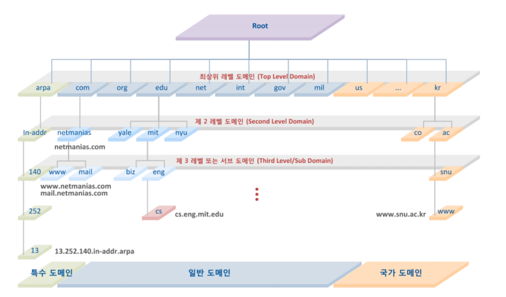
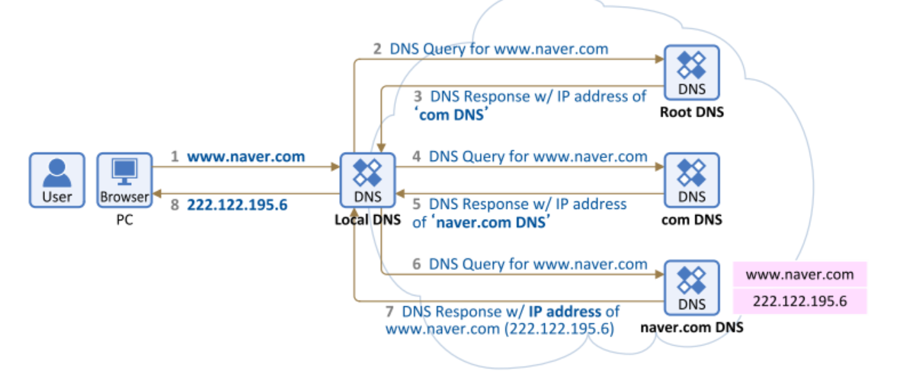

DNS
===================================
DNS(Domain Name System)
-----------------------------------
# 개요
* 도메인 이름과 IP주소를 변환하는 역할   
* 영어/한글 주소(도메인)를 네트워크에서 찾아갈 수 있는 IP로 변환해 주는 시스템   
* 이 DNS를 운영하는 서버를 Name Server라고 함   
* Name Server는 모든 PC의 URL과 IP 정보를 저장함   
* 포트번호는 53번을 사용   
 
# 과정
1. 클라이언트는 웹 브라우저에 접속하고자 하는 사이트의 도메인 이름(www.naver.com 등)을 입력
2. DNS 서버(Name Server)가 해당 도메인 이름과 일치하는 IP주소를 찾고 접속을 가능하게 해줌

# 구성요소
* DNS는 전 세계 분산형 DB 구조로 동작   
1. Domain Name Space   
> DNS가 저장, 관리하는 계층적 자료구조   

   
   
> 최상위에 루트 DNS서버가 존재하고 그 밑으로 인터넷에 연결된 노드가 연속해서 이어진 계층구조로 구성   
> 각 층의 도메인들은 그 하위 도메인에 관한 정보를 관리하는 구조   

2. Name Server  
> 영어/한글로 표현된 도메인 이름을 IP주소로 변환하기 위한 Domain NameSpace의 데이터를 갖고 있는 서버   
> Resolver로부터 요청받은 도메인 이므에 대한 IP정보를 다시 Resolver로 전달   

3. Resolver(Client S/W)   
> 클라이언트의 요청을 네임 서버로 전달 및 네임 서버로부터 도메인 이름과 IP주소를 받아 클라이언트에게 제공   
> 네임 서버에 요청을 했을 때, 해당 서버의 정보가 없으면 다른 네임 서버에게 요청을 보내 정보를 받아온다   

# 동작 과정

   
   
* 1,2,3 : Root DNS 서버는 전체 도메인 정보는 알지 못하기 때문에 자신의 하위 Domain인 COM DNS 서버의 주소를 알려줌

* 4, 5 : 이를 수신한 Local DNS 서버는 다시 com DNS 서버에게 정보를 요청하고, com DNS 서버도 자신의 하위 레벨 Domain인 naver.com의 DNS서버 주소를 알려줌

* 6, 7 : 이를 수신한 Local DNS 서버는 다시 naver.com DNS 서버에게 www 호스트에 대한 정보를 요청하고, naver.com DNS 서버는 www.naver.com 에 대한 IP서버 주소를 알려줌

* 8 : Local DNS 서버는 위와 같이 www.naver.com 에 대한 IP주소를 수신 후 자신의 DNS Cache에 등록하고 해당 정보를 요청했던 클라이언트에에게 응답 전송

  
